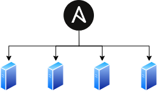
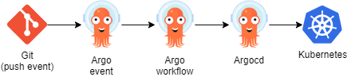

# HomeServer Provisioning

This project contains the playbook to provision my home servers.

It creates a Kubernetes cluster on self hosted bare metal hosts and deploy apps.

It also contains a Vagrant environment to test the playbooks and services.

## Why self-hosted

Not taking into account personal bias about hosting in the cloud, I'm running 2 types of services that are not compatible with cloud providers :

1. Home automation :
   * I need access to physical devices (USB sticks)
   * I don't want to lose access to my automations if my internet connexion goes down
2. Media Streaming
    * The cost would be too high (storage + cpu to transcode)

Going the self-hosted route has a few [consequences on the infrastructure](docs/Bare_metal_considerations.md).

## Hosts

The underlying hardware is detailed on a [dedicated page](docs/Hardware_detail.md), but to keep it short :

| Type      | Cores | CPU Model                                                                                                                                |  RAM  | Storage   |
| --------- | :---: | ---------------------------------------------------------------------------------------------------------------------------------------- | :---: | --------- |
| master-1  | 8/16  | [AMD Ryzen 7 5700G](https://www.amd.com/en/products/apu/amd-ryzen-7-5700g)                                                               |  32G  | SSD 1T    |
| master-2  | 8/16  | [AMD Ryzen 7 5700G](https://www.amd.com/en/products/apu/amd-ryzen-7-5700g)                                                               |  32G  | SSD 1T    |
| master-3  | 8/16  | [AMD Ryzen 7 5700G](https://www.amd.com/en/products/apu/amd-ryzen-7-5700g)                                                               |  32G  | SSD 1T    |
| node-1    |  4/8  | [Intel i5-8259U](https://ark.intel.com/content/www/us/en/ark/products/135935/intel-core-i5-8259u-processor-6m-cache-up-to-3-80-ghz.html) |  32G  | SSD 500G  |
| node-2    |  4/8  | [Intel i5-8259U](https://ark.intel.com/content/www/us/en/ark/products/135935/intel-core-i5-8259u-processor-6m-cache-up-to-3-80-ghz.html) |  32G  | SSD 500G  |
| node-home |  4/4  | [Intel Atom x5 Z8350](https://ark.intel.com/products/93361/Intel-Atom-x5-Z8350-Processor-2M-Cache-up-to-1-92-GHz-)                       |  2G   | Flash 32G |

## High availability

More information on the [dedicated page](docs/High_availability.md).

Spoiler : it's not really HA.

## Vagrant

To test this cluster, take a look at the [Vagrant page](docs/Vagrant.md).

## Services

The following services are deployed :

| Service                                                          | Description                                                     |
| ---------------------------------------------------------------- | --------------------------------------------------------------- |
| [OpenLDAP](https://www.openldap.org/)                            | Open source Lightweight Directory Access Protocol               |
| [LemonDAP](https://lemonldap-ng.org/welcome/)                    | Web Single Sign On and Access Management Free Software          |
| [phpLDAPadmin](http://phpldapadmin.sourceforge.net/)             | Web-based LDAP browser                                          |
| [Gitea](https://gitea.io/)                                       | Painless self-hosted Git service                                |
| [MinIO](https://www.crowdsec.net/)                               | S3 compatible object store                                      |
| [Argo Events](https://www.crowdsec.net/)                         | Event-driven workflow automation framework for Kubernetes       |
| [Argo Workflows](https://www.crowdsec.net/)                      | Kubernetes-native workflow engine                               |
| [ArgoCD](https://www.crowdsec.net/)                              | Declarative, GitOps continuous delivery tool for Kubernetes     |
| [Crowdsec](https://www.crowdsec.net/)                            | Collaborative malicious activity detection and remediation tool |
| [ZoneMTA](https://github.com/zone-eu/zone-mta)                   | Modern outbound SMTP relay                                      |
| [MailHog](https://github.com/mailhog/MailHog)                    | MailHog is an email testing tool for developers                 |
| [Blocky](https://0xerr0r.github.io/blocky/)                      | DNS proxy and ad-blocker for the local network                  |
| [Ntfy](https://ntfy.sh/)                                         | Send push notifications to your phone or desktop via PUT/POST   |
| [Prometheus](https://prometheus.io/)                             | Monitoring solution                                             |
| [AlertManager](https://github.com/prometheus/alertmanager)       | Alert manager for Prometheus                                    |
| [Grafana](https://grafana.com/)                                  | Platform for beautiful analytics and monitoring                 |
| [Fluent Bit](https://fluentbit.io/)                              | Lightweight log Processor and Forwarder                         |
| [FluentD](https://www.fluentd.org/)                              | Log Processor and Forwarder                                     |
| [OpenSearch](https://opensearch.org/)                            | Distributed, RESTful search and analytics engine                |
| [OpenSearch Dashboard](https://opensearch.org/)                  | Visualize your Elasticsearch data                               |
| [Unifi Controller](https://unifi-sdn.ubnt.com/)                  | Controller for Unifi devices                                    |
| [HomeAssistant](https://www.home-assistant.io/)                  | Home automation                                                 |
| [ESPHome](https://esphome.io/index.html)                         | System to control your ESP8266/ESP32                            |
| [Z-Wave JS UI](https://zwave-js.github.io/zwave-js-ui/)          | Fully configurable Zwave Gateway and Control Panel              |
| [Frigate](https://blakeblackshear.github.io/frigate/)            | Local NVR designed for Home Assistant with AI object detection  |
| [Node-RED](https://nodered.org/)                                 | Flow-based programming for the IoT                              |
| [Mosquitto](https://mosquitto.org/)                              | MQTT broker                                                     |
| [RoomAssistant](https://github.com/mKeRix/room-assistant)        | Presence tracking                                               |
| [Homepage](https://gethomepage.dev/)                             | A highly customizable homepage with service API integrations    |
| [Miniflux](https://miniflux.app/)                                | Miniflux is a minimalist and opinionated feed reader            |
| [Reminiflux](https://github.com/reminiflux/reminiflux)           | Alternative web frontend for miniflux                           |
| [Nextcloud](https://nextcloud.com/)                              | The self-hosted productivity platform that keeps you in control |
| [PaperlessNGX](https://github.com/paperless-ngx/paperless-ngx)   | Scan & OCR documents                                            |
| [OliveTin](https://docs.olivetin.app/)                           | Access to predefined shell commands from a web interface.       |
| [Syncthing](https://syncthing.net/)                              | Continuous file synchronization                                 |
| [Jellyfin](https://jellyfin.org/)                                | Video streaming                                                 |
| [Airsonic](https://airsonic.github.io/)                          | Music streaming                                                 |
| [Sickchill](https://sickchill.github.io/)                        | Automatic Video Library Manager for TV Shows.                   |
| [Deluge](https://deluge-torrent.org/)                            | Torrent client                                                  |
| [pyload](https://pyload.net/)                                    | HTTP download manager                                           |
| [SABnzbd](https://sabnzbd.org/)                                  | Binary newsreader                                               |

## DevOps

Ansible is used to deploy the infrastructure:

Once everything is configured, applications are deployed automatically using the argo suite:

DevOps tools are deployed in the cluster. See the dedicated [DevOps](docs/DevOps.md) documentation for more details.

## Backups

Different tools are deployed to handle [backing the cluster up](docs/Backups.md).
Mainly, [restic](https://restic.net/) backs up critical data (host, app, nas), and then [Rclone](https://rclone.org/) copies the restic repositories off site (second Nas and GCS)
