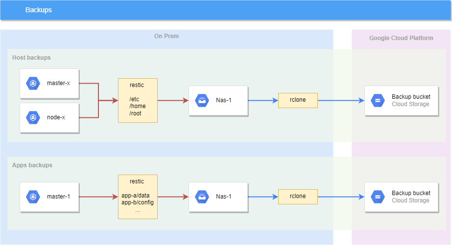

# Backups

## Tools

### Restic

Backups are mostly managed by [restic](https://restic.net/).

We are using the [restic rest server](https://github.com/restic/rest-server) on Nas-1 to store the repositories in one place.

Multiple repositories are used, and are described below.

### Rsync

Rsync is used to duplicate files between Nas-1 and Nas-2.

### Rclone

[Rclone](https://rclone.org/) is used to clone restic repositories out of Nas-1, to remote targets.

## Sources

### Host files

On all our hosts, we backup a few critical file systems using restic in a `host_backup` repository.

These backups are not meant to restore a whole host. If a catastrophic failure occurs, the host should be redeployed using Ansible.

We still backup a few filesystems like `/etc`, `/root` and `/home` from all our machines.

### App data

We backup the applications data using restic in a `app_backup` repository.

A few stateful applications are ignored in the process. For example, we don't want to backup Prometheus or ElasticSearch.

### Nas data

#### Critical data

We backup Nas critical data using restic in a `nas_backup` repository.

#### Medium criticity data

We have some folders on the Nas that we don't want to backup (too large and not critical enough), but we still want a bit more safety.

These folders are simply rsync'ed to the other Nas.

#### Low criticity data

Finally some folders are completely ignored. If one Nas crashes, they will be lost.

## Offsite

The restic repositories are accessed on Nas-1. To avoid loosing them if Nas-1 crashes, they are copied to 2 locations.

### Nas-2

We daily rclone the repositories to Nas-2.

### GCS

We also daily rclone the repositories to a bucket in GCS.
