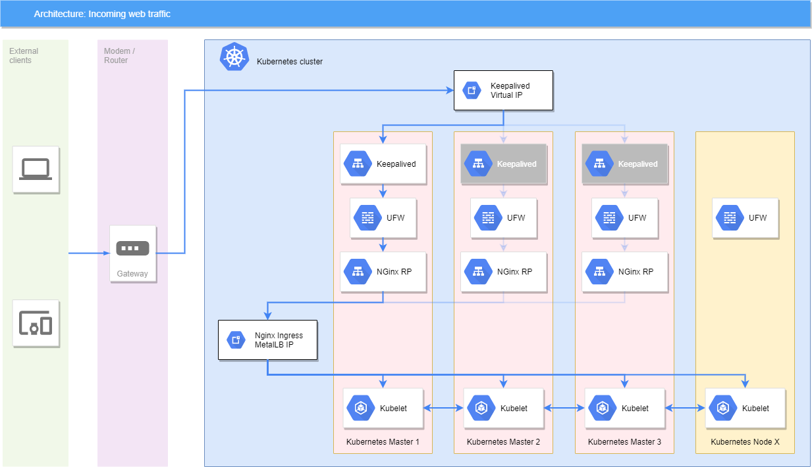
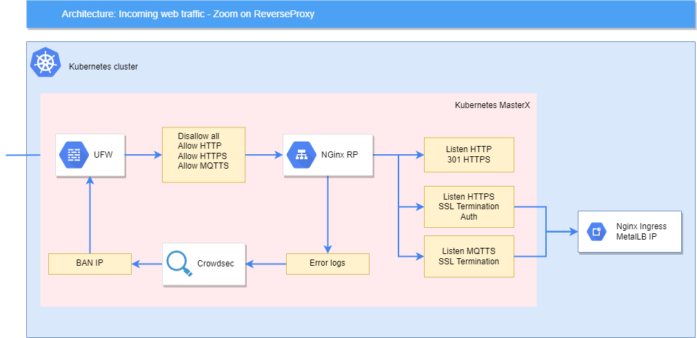

# Bare metal

Using kubernetes with a cloud provider is quite magical. Many thinkgs just work.

On bare metal however, it involves less magic and more work ;p

## Network

(See [NGINX Ingress Controller - Bare-metal consederations](https://kubernetes.github.io/ingress-nginx/deploy/baremetal/))

To route inbound trafic to the ingress, we've choosen to use a non-containerized NGinx Reverse Proxy.

It matches the [Using a self-provisioned edge](https://kubernetes.github.io/ingress-nginx/deploy/baremetal/#using-a-self-provisioned-edge) section of the documentation.



This NGinx RP is used for : 
 - SSL termination
 - Basic Authentication when needed
 - Basic load balancer to the various nodes

It also provides error logs parsed by [Fail2Ban](https://www.fail2ban.org/wiki/index.php/Fail2Ban).

The NGinx Ingress is exposed as a NodePort in Kubernetes and the RP merely forwards requests to this port.



## Storage

Kubernetes doesn't provide a dynamic storage provider on bare metal installations.

### Many bare metal options ...

To keep things simple, you can use a [hostPath](https://kubernetes.io/docs/concepts/storage/#hostpath) provisioner.
However, it statically binds a path to a container, so it's far from a dynamic system.

[NFS](https://kubernetes.io/docs/concepts/storage/#nfs) would also be a simple solution, however that would be yet another SPOF in the system, and it would offer poor IO.

On the opposite side of the spectrum, you can use a network filesystem with a dynamic provider ([GlusterFS](https://kubernetes.io/docs/concepts/storage/#glusterfs) and [CephFS](https://kubernetes.io/docs/concepts/storage/#cephfs)), but for a small home installation it's probably overkill.

To try and find a middle ground, the [local](https://kubernetes.io/docs/concepts/storage/#local) allows the static creation of Volumes, and a dynamic claim from pods.

### On to local volumes !

Scripting the creation of local volumes is trivial  (`mkdir` and `kubectl`). However, using plain folders means that the `capacity` attribute of volumes is not enforced. A single rogue container can fill the whole host filesystem that contain the volume.

To have a more robust system, we've used LVM LogicalVolumes.

The ansible playbook creates a dedicated LV for each Volume. That way, a container can't use more than the allocated size.

Using LVs mean that we can easily extend an existing volume if the space requirement increases over time.

### Local volume tagging

As we create all the Volumes before creating the Persistant Volume Claims, we can't be sure that the prepared volumes are bound to the correct pod.

To make sure of it, we use labels.

Volumes are tagged in the same way other Kubernetes objects are, using the usual `app` and `tier` labels.

For example, if we have a stateful application that has both a frontend and MySQL DB, the pods and associated volumes will have the tags : 
 - `app: my-awesome-app`, `app-component: my-awesome-app`
 - `app: my-awesome-app`, `app-component: mysql`

The Persistant Volume Claim will use these same labels as selectors : 

```yaml
volumeClaimTemplates:
- metadata:
    name: my-awesome-app-pv-claim
  spec:
    [...]
    selector:
      matchLabels:
        app: my-awesome-app
        tapp-component: my-awesome-app
```

## Host tagging

We can't really schedule all our applications on any Kubernetes node.

- Some applications require dedicated hardware on the machine (Home automation requires USB sticks plugged in)
- Some node are far less powerful (Plex transcoding on a Atom CPU is not a good idea)

To avoid those issues without hard-pinning the applications on dedicated nodes, we use a looser tagging system.

Nodes are tagged according to their capabilities.
For example : 
```yaml
labels:
  capability/general-purpose: "yes"
  capability/home: "no"
```

Accordingly, the pods use a NodeSelector : 

```yaml
nodeSelector:
  capability/general-purpose: 'yes'
```
