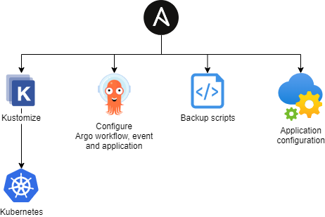

# DevOps

## High level view

Ansible is used to deploy the infrastructure:


Once everything is configured, applications are deployed automatically using the argo suite:


## Requirements

### Private solution

Keeping the Kubernetes control plane private prevents the use of most Cloud-hosted solutions.

Some Cloud solutions support having private components (for example, Github's private runners), but we want to avoid depending on a Cloud solution for a self-hosted platform.

### Tools inside the cluster

Ideally, I would run a dedicated DevOps platform to deploy our Kubernetes cluster and applications.

However, I don't have resources available outside the Kubernetes cluster to host testing and production stacks.

Having everything deployed in the same cluster is easier in terms of resource management and being able to spin up an isolated test cluster.

## Deployment process

### Infrastructure

The infrastructure is deployed using Ansible.

The Ansible playbook is run manually, from a controller node.
I currently use a node inside the cluster as a controller, but I could use an external host or my development machine.

### Applications, 1st manual Ansible deployment

The automated GitOps process can't cover everything required by the applications deployments:

* As our DevOps stack is deployed inside the cluster, it must first be deployed manually
* The GitOps process only deploys application inside Kubernetes. Some components are deployed on the cluster nodes
  * Backup scripts
  * CLIs (argo / argocd CLI deployed on the controller node)
  * Application configuration (OpenLDAP users and groups, ElasticSearch index templates, ...)



To have all those requirements deployed, each application is deployed at least once using Ansible.

### Applications, Hybrid

To be able to iterate quickly in development, applications can be deployed in a hybrid mode.

Ansible is still used to manually trigger deployments.
However, the build and deploy steps are handled by the GitOps tools.


### Applications, GitOps

To update applications in Production, the full GitOps process is used.


## Deployment details

### Folder structure

Each application is configured in a dedicated folder under the `apps` folder.

```
apps
├── base
│   └── [app-1]
│       ├── build
│       │   ├── [image-1]
│       │   │   ├── Dockerfile
│       │   │   └── vars.yaml
│       │   └── [image-2]
│       │       ├── Dockerfile
│       │       └── vars.yaml
│       └── deploy
│           ├── config
│           │   └── [some-file].conf
│           │   └── [some-file].env
│           ├── [manifests].yaml
│           ├── kustomization.yaml
│           └── namespace.yaml
└── vagrant
    └── [app-1]
        └── deploy
            ├── config
            │   └── [some-file].env
            ├── [patch-resources].yaml
            └── kustomization.yaml
```

This repo contains the base and vagrant overlay folders.
Overlays for other environments are stored on other private repositories.

#### base/build folder

Applications can use multiple container images.

Each subfolder is a distinct image. It must at least contain a `Dockerfile` and `vars.yaml`.

`Dockerfile` can be as simple as:

```Dockerfile
FROM [public-image]
```

`vars.yaml` configures the private image built:

```yaml
image_name: [private-image-name]
image_tag: [private-image-version]
```

#### base/deploy folder

Applications are deployed using Kustomize.

A minimal `kustomization.yaml` can be :

```yaml
apiVersion: kustomize.config.k8s.io/v1beta1
kind: Kustomization

namespace: [app-namespace]

resources:
- namespace.yaml
- ../../_common/deploy
- [other resources].yaml
```

It always includes the resource `../../_common/deploy`, which injects common `ConfigMap`/`Secret` in the namespace.

#### vagrant/deploy folder

A vagrant overlay is prepared.

It is used to prepare the structure for other environments:

* patches to set different resource requests/limits (even if for vagrant is uses the same base values)
* configurations with environment specific values

### Cluster secrets injection

Some secrets files are generated by the ansible playbooks (for eg, the private PKI).

To easily have those files available as Kubernetes Secrets in an application's namespace, we use [kubernetes-replicator](https://github.com/mittwald/kubernetes-replicator):

* Secrets are generated in the `cluster-secrets` namespace by the ansible role `ansible\install_infra\roles\kubernetes_secrets_deploy`
* Common secrets are automatically pushed in all namespaces
  * `docker-config`, to be able to pull images from our internal docker registry
  * `cluster-ca`, to trust our self-signed certificates
* Specific secrets are pulled when an application needs them

### Encryption

To be able to easily store secrets in the repository, we use [SOPS](https://github.com/mozilla/sops) to encrypt them with age.

The age private key is stored in the ansible inventory variables in `sops_age_key_content`.
or vagrant, this private key is tracked in git (which is totally insecure, but easier for test purposes).

In each `apps/vagrant/[application]`, a `.sops.yaml` file configures how/what to encrypt.

To easily encrypt / decrypt secrets, a helper script can be used: `apps/vagrant/sops.sh`. It can:

* Encrypt all files from `secret-decrypted` to `secret`
* Decrypt all files from `secret` to `secret-decrypted`

```bash
/opt/provision/apps/vagrant/sops.sh app-name encrypt
/opt/provision/apps/vagrant/sops.sh app-name decrypt
```

### Workflow steps

When triggered to deploy an application, the Argo workflow runs the following steps :

1. Fetch the application source from both the base and overlay repositories
    * Using rsync in test mode
    * From Git in production mode
    * List the container images to build
2. Build each container image in parallel
3. Trigger the Argo CD app sync
    * Using --local in test mode
    * From Git in production mode

### MinIO

To share files between steps of the Argo workflows, we can either use an artifact repository, or share a volume.

Sharing a `ReadWriteOnce` volume prevents us from running multiple steps in parallel (building multiple container images).

MinIO is used to store Argo workflows artifacts and logs. Artifacts and logs retention is configured TODO

## Test

To test this setup on vagrant, we can use the internal Gitea server.

* Create an organization : MyOrg
* Create a repository : MyOrg/home-server
* Allow the `argo` user to access this repository
* Create a webhook to `http://webhook-eventsource-svc.dev-argo-tasks.svc.cluster.local:12000/git`
* And use the `develop` branch
