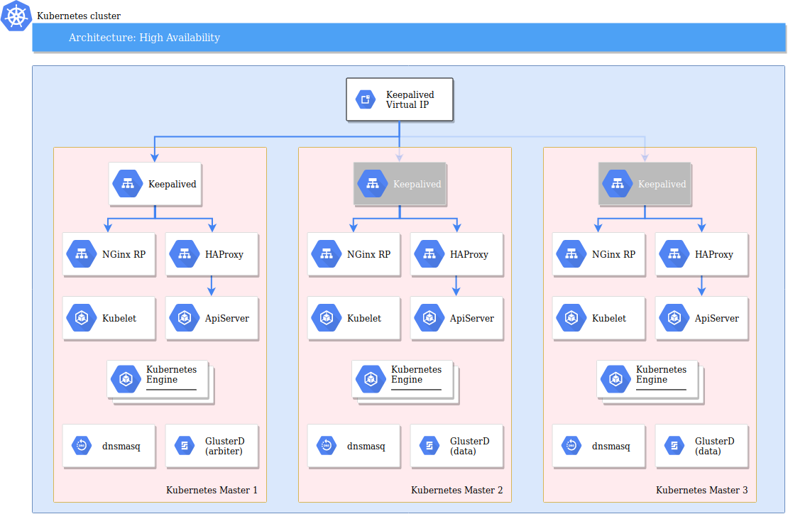

# High availability

To be clear, the cluster installed by this playbook isn't high available.

## Hardware

On the hardware side of things, at least 2 major points of failure remain :

* Single internet link
* Single power delivery (alleviated by a UPS)

Also as it's a home setup, it's obviously not replicated across multiple sites.

## Software stack

On the software stack side however, most of the components are configured to be "high-available ready".
By that I mean that the cluster I've built isn't sized to be HA, but it's "only" a matter of throwing more CPUs / RAM at it.

### DNS

dnsmasq is used for local resolution.

It's installed on the 3 master nodes, and all nodes in the cluster are configured to used them.

**HighAvailability** : dnsmasq tolerates the loss of 2 master nodes

### Kubernetes

Kubernetes is installed using 3 master nodes, using the [stacked etcd topology](https://kubernetes.io/docs/setup/independent/ha-topology/#stacked-etcd-topology)

The apiserver is accessed though a HAProxy that distributes requests across the 3 master nodes.

**HighAvailability** : Kubernetes tolerates the loss of 1 master node

### Storage

All persistent volumes use Longhorn.

The Longhorn provisionner is deployed at least on our 3 master nodes.
The Longhorn volumes are using at 2 or 3 replicas.

**HighAvailability** : Longhorn tolerates the loss of at least 1 node

### Reverse Proxy

Keepalived is used to be sure we have an HA virtual IP.

On each master node, an NGinx instance is configured to access all the published services.

`master-1` is set as the default `master` node, with `master-2` and `master-3` as `backup`s.

**HighAvailability** : Reverse proxy tolerates the loss of 2 master nodes

There are 2 limitations with this setup :

#### SSL Cert

`master-1` is responsible for SSL cert renewal using certbot.

If it stays down for a long period, SSL certs will expire.

#### Load balancing

Traffic is not load balanced between the 3 NGinx instances.

It could easily be added. However, using a single active NGinx instance allows for a more effective fail2ban filtering.
If an IP tries to scan or brute force access to the cluster, fail2ban add an iptables rule to deny this IP. Using 3 hosts means that each instance will have its own fail2ban counters and its own iptables rules. It will allow for more tries before denying the IP.

## Applications

Finally on the applications side, it's a bit more hit-and-miss. But mostly miss.

### Docker registry

The private registry is scaled to 2 instances, and could be scaled up even more if required.

### Blocky

It is scaled to 2 instances by default to be *mostly* HA.

DNS queries are logged to a PostgreSQL database.
A Redis database is used to share state between Blocky instances.

PostgreSQL and Redis are only using 1 instance.
If they go down, Blocky will still work, with the following limitations :

* DNS queries log fall back to stdout
* state is not shared between Blocky instances

This is the best compromise to still have DNS when a node goes down, but avoid consuming too much resources to build HA PostgreSQL and Redis clusters.
